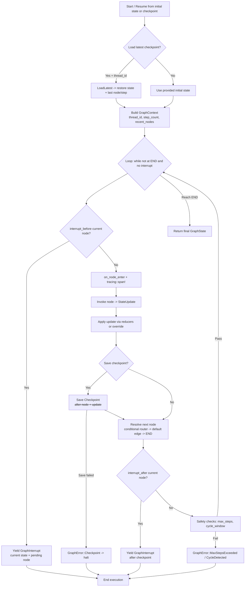

# Wesichain Phase 7 Stateful Graphs + Basic Agents Design

Date: 2026-02-04
Status: Draft

## Goals
- Deliver stateful, resumable, graph-based workflows with cycles and conditional routing.
- Keep API compatibility with existing GraphBuilder, GraphState, and Checkpointer.
- Provide LangGraph-like ergonomics (START/END, conditional edges, interrupts) in Rust.
- Support checkpointing, basic memory, and a ReAct-style agent loop.
- Add streaming and observability hooks without heavy dependencies.

## Non-goals
- Parallel fan-out or join semantics in the execution loop.
- External checkpoint backends (sqlite/postgres/redis) in this phase.
- Vector-backed memory or long-term memory search (Phase 8+).
- Dynamic interrupts triggered from inside nodes (static before/after only).
- Provider expansion beyond existing LLM/tool integrations.

## Scope (Phase 7 MVP)
- Stateful graph primitives in `wesichain-graph` with petgraph internals.
- Additive state updates via a reducer trait with built-in reducers.
- Graph-level checkpointing with in-memory and JSONL file backends.
- Memory nodes for conversation buffer integration.
- Tool calling loop using `ReActAgentNode` plus a `ToolNode`.
- Human-in-the-loop interrupts with resume.
- Streaming `GraphEvent` and `Observer` callbacks.
- Examples, migration doc, and benchmarks.

## Key Decisions
- Backward-compatible extensions only; no breaking API changes.
- Sequential execution (one active node per step) for MVP.
- `StateSchema` keeps `Serialize + DeserializeOwned` bound for persistence.
- Reducer trait is opt-in; default merge is last-write-wins.
- petgraph is internal; public API stays on `GraphBuilder`/`ExecutableGraph`.

## Architecture
**Summary**: Keep the public builder stable while compiling to a petgraph-backed program for fast routing and safety checks.
`GraphBuilder` remains the public builder and produces an `ExecutableGraph`. Internally it compiles to a `GraphProgram` backed by petgraph with a name-to-index map for fast lookup. Nodes are still `Runnable<GraphState<S>, StateUpdate<S>>` and execution remains sequential. Conditional routing is represented as separate edges in the compiled graph with an attached router function per source node.

`START` and `END` are provided as constants for LangGraph-style wiring, while `set_entry` remains valid. Execution is driven by a `GraphContext` that tracks `thread_id`, `step_count`, and `recent_nodes` for safety checks and resume logic.

## State and Reducers
**Summary**: Reducers are opt-in and implemented on the user state struct to control merge behavior.
Keep `GraphState<S>` and `StateUpdate<S>` intact. Add an opt-in reducer trait implemented by the state type (for example, `AgentState`):

```rust
pub trait StateReducer: StateSchema {
    fn merge(current: &Self, update: Self) -> Self;
}
```

`GraphState::apply_update` uses `StateReducer::merge` when implemented; otherwise it falls back to last-write-wins (current behavior). Built-in reducers are helper types or functions used inside a custom `merge` implementation:

- `AppendVec<T>` for message and document accumulation.
- `MergeMap<K, V>` for metadata/tool results.
- `AddCounter` for counters and metrics.
- `Override` for last-write-wins fields.

This preserves existing behavior while enabling additive updates for messages, retrieved docs, tool observations, and counters.

## Graph Primitives and Builder Extensions
**Summary**: Add conditional routing, interrupts, observers, and streaming without breaking the existing builder API.
Additive methods on `GraphBuilder`:

- `add_conditional_edges(source, router, path_map)` (new, plural). Keep `add_conditional_edge` as-is.
- `with_default_config(ExecutionConfig)` for Phase 4 defaults.
- `with_checkpointer(checkpointer, thread_id)`.
- `with_interrupt_before(nodes)` and `with_interrupt_after(nodes)`.
- `with_observer(observer)`.
- `stream_invoke` / `stream_invoke_with_options` for streaming events.

Conditional routing takes precedence over default edges. If a router returns an unknown node ID, execution fails with `GraphError::InvalidEdge`.

## Execution Model
**Summary**: Sequential single-node-per-step loop with interrupts, observers, checkpoints, and conditional routing.
Execution is a single sequential loop. For each node:

1. Check `interrupt_before` and yield `GraphInterrupt` if matched.
2. Notify observer `on_node_enter` and start a tracing span.
3. Invoke node to get `StateUpdate<S>`.
4. Apply update via reducers or override.
5. Save checkpoint if configured.
6. Resolve next node: conditional router first, then default edge, else `END`.
7. Check `interrupt_after` and yield `GraphInterrupt` after checkpointing.
8. Update `step_count` and `recent_nodes`; enforce max steps and cycle detection.

Execution starts from the provided state unless a checkpointer + thread_id are configured and `load_latest(thread_id)` returns a prior checkpoint, in which case resume uses the latest checkpoint state.

### Visual Overview
The following diagram shows the core sequential execution loop, including interrupt checks, checkpointing, and next-node resolution.



## Checkpointing and Persistence
**Summary**: Graph-level checkpoints are written after each node and are required for resume.
Keep the `Checkpointer` trait and add a richer checkpoint payload:

```rust
pub struct Checkpoint<S> {
    pub thread_id: String,
    pub state: GraphState<S>,
    pub step: u64,
    pub node: String,
    pub created_at: String,
}
```

`GraphState<S>` keeps the checkpoint type aligned with graph execution APIs; if we later drop the wrapper, store `S` directly.

Backends:
- `InMemoryCheckpointer`: stores `HashMap<ThreadId, Vec<Checkpoint>>` for dev/testing.
- `FileCheckpointer`: append-only JSONL per thread using sanitized thread IDs.
- Optional `HistoryCheckpointer` helper to list metadata without loading full state.

Checkpointing occurs after each node execution. Failures to save or load return `GraphError::Checkpoint` and halt execution to avoid ambiguous resume state.

## Memory Integration
**Summary**: Memory is optional and integrated via graph nodes that read and append messages.
Memory traits remain in `wesichain-core`. Add graph-level helpers:

- `ConversationBufferNode`: reads prior messages and appends new messages to state using `HasMessages` and `HasUserInput` traits.
- `ConversationSummaryBuffer` is a stretch component that summarizes older messages when token budget is exceeded.

Memory nodes are optional and can be placed anywhere in the graph. Reducers handle append semantics for message lists.

## ReAct Agent Loop
**Summary**: ReAct is modeled as a cycle between Agent and Tool nodes with conditional routing.
Use `ReActAgentNode` from Phase 5 for tool-calling LLM behavior. Add a `ToolNode` that executes tool calls and writes observations into state. A typical loop:

Agent -> conditional: tool calls? -> ToolNode -> Agent -> ... -> END

Tool error policies follow Phase 5: fail fast or append error observation and continue. Malformed tool calls always fail fast.

## Human-in-the-Loop
**Summary**: Static interrupts pause before or after nodes and return a resumable state snapshot.
Compile-time interrupt lists drive pauses:

- `interrupt_before`: pause before executing a node.
- `interrupt_after`: pause after executing a node and checkpointing.

Interrupts return `GraphInterrupt` containing the current state snapshot, node, and optional input schema. Resume injects user input into state via reducers and continues from the correct node.

## Observability and Streaming
**Summary**: Observers and tracing provide visibility; streaming yields ordered graph events.
Provide an `Observer` trait with callbacks:

- `on_node_enter`, `on_node_exit`, `on_error`, `on_checkpoint_saved`.

Integrate `tracing` spans per node and per step. Streaming yields `GraphEvent` values for node transitions, tokens, tool calls/results, checkpoint saves, and interrupts. Streaming must preserve event ordering and terminate on errors.

## Error Handling
**Summary**: Fail fast with explicit graph errors and preserve node error context.
`GraphError` variants include:

- `NodeFailed { node, source }`
- `MissingNode`
- `InvalidEdge`
- `MaxStepsExceeded { max, reached }`
- `CycleDetected { node, recent }`
- `Checkpoint(String)`
- `Interrupted`

`ExecutableGraph::invoke*` returns `Result<GraphState<S>, GraphError>`. Node-level `WesichainError` is wrapped in `NodeFailed` to distinguish it from graph failures. Checkpoint errors halt execution. Cycle detection and max-step guards trigger before executing the next node.

## Testing
**Summary**: Validate reducers, safety guards, interrupts, checkpointing, and streaming determinism.
- Reducer behavior: default override, append, merge, add counter.
- Conditional routing with cycles and safety guards.
- Interrupt semantics (before/after) and resume behavior.
- Checkpointer: JSONL append, load latest, history order, corrupt tail.
- Streaming event ordering and termination on errors.
- ReAct loop: tool call routing and failure policies.

## Examples and Migration Docs
**Summary**: Provide focused examples and a LangGraph-to-Wesichain mapping doc.
Examples in `wesichain-graph/examples`:

- `simple_retrieval_graph.rs`
- `react_agent.rs`
- `persistent_conversation.rs`
- `human_in_loop_review.rs`

Migration doc: `docs/migration/langgraph-to-wesichain.md` with side-by-side mappings:
- StateGraph -> GraphBuilder
- add_node/add_edge/add_conditional_edges
- compile(checkpointer, interrupt_before/after)
- START/END usage

README updates should highlight START/END, reducers, and checkpoint resume.

## Benchmarks
**Summary**: Measure checkpoint overhead and concurrency contention using the existing harness.
- 10-step agent loop with checkpointing enabled vs disabled (time per step, RSS delta).
- 100 concurrent thread IDs load test to validate file checkpointer contention.
- Align benchmark harness with Phase 6 to avoid new infra.

## Dependencies
- petgraph (internal representation)
- serde + serde_json or bincode for checkpoints
- tracing for observability
- uuid for thread IDs (if not already used)

## Risks and Mitigations
- Reducer misuse or confusion: provide built-in reducers and examples.
- Checkpoint corruption: append-only JSONL, strict error handling, test corrupt tail.
- Observability overhead: keep observer optional, feature-gate heavy tracing.
- Resume ambiguity: save after each node, store node ID in checkpoint.

## Rollout Order
1. Reducers and extended graph primitives (no persistence changes).
2. ReAct loop with ToolNode and cycles.
3. Checkpointing backends and resume logic.
4. Memory nodes and examples.
5. Human-in-the-loop interrupts.
6. Streaming and tracing polish.
7. Benchmarks and migration docs.

## Future Work
- Parallel fan-out and join semantics.
- Optional checkpoint codecs beyond serde.
- Vector-backed memory and long-term recall.
- External checkpoint backends (sqlite/postgres).
- Dynamic interrupts triggered from nodes.
